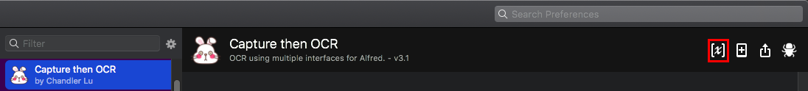
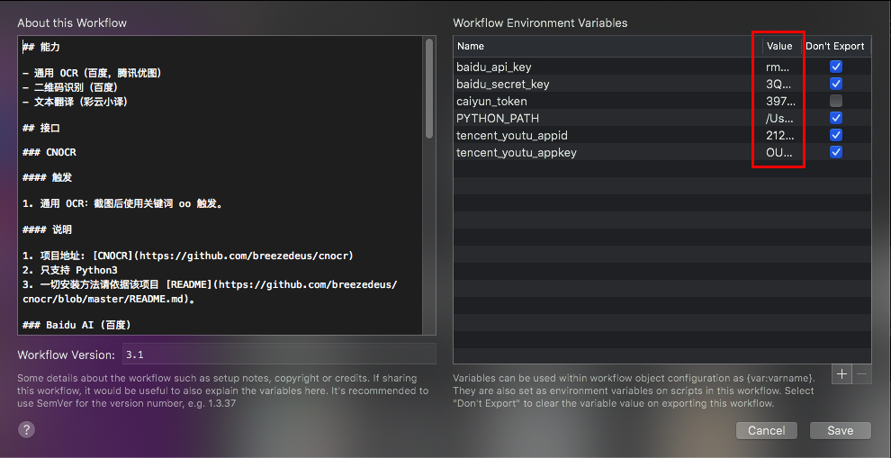
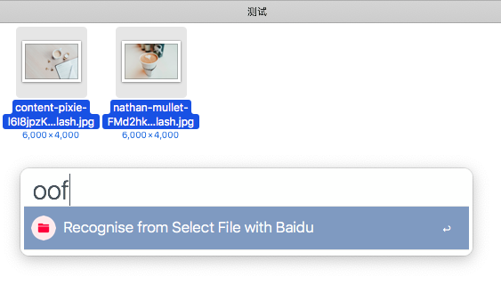

# Alfred - OCR and Translation

## Language

简体中文 | [English](https://github.com/Chandler-Lu/alfred-ocr/blob/master/README.md)

## 下载地址

[国内直链](http://bz.cndzq.com/ltr970503/3_software/2_tool/Capture%20then%20OCR.zip) 或 [Github-Release](https://github.com/Chandler-Lu/alfred-ocr/releases)

## OCR Demo


## Translate Demo


## 版本

### 4.2 (2020-01-16 12:54)

- 鉴于百度更改了二维码识别收费方案，触发关键词 `ooq` 替换为由开源模块 [ZXing](https://github.com/dlenski/python-zxing) 的二维码识别，原有百度二维码识别的触发方式更改为 `ooqb`。

## 能力

- 离线 OCR (CNOCR)
- 通用 OCR (百度，腾讯优图，Google)
- 二维码识别 (百度，ZXing)
- 表格文字识别 (百度)
- 多文件识别 (百度)
- 文本翻译 (彩云小译)

## 使用（必看！！）

1. 这**不是**一个开箱即用的产品！
2. 您至少要拥有 macOS Alfred 3 及以上版本并激活 Powerpack。
3. 您需要安装 Python 3 及相应的依赖模块，并将 Python 3 路径填写在`PYTHON_PATH`处。
4. 您需要申请并将对应接口的配置填入环境变量，部分接口附带我自己的 Key，但严禁滥用。
5. 具体配置方法请移步 [安装方式](https://github.com/Chandler-Lu/alfred-ocr/wiki/Install-Python(CN))。

### 设置方式




## 依赖

### CNOCR

``` bash
pip install cnocr
```

### ZXing

``` bash
pip install zxing
```

### 其他

``` bash
pip install requests
```

## 接口

### [CNOCR](https://github.com/breezedeus/cnocr)

#### 触发

- 使用关键词 oo 触发截图选框。

#### 说明

- 一切安装方法请依据该项目 [README](https://github.com/breezedeus/cnocr/blob/master/README.md)。

### [Baidu AI (百度)](https://ai.baidu.com/tech/ocr)

#### 触发

1. 通用 OCR：快捷键 ctrl+v 触发截图选框，或截图至剪贴板后使用关键词 oob (baidu) 触发；
2. 二维码识别：截图后使用关键词 ooqb (qr baidu) 触发；
3. 表格文字识别：截图后使用关键词 ooe (excel) 触发，识别后可直接复制至 Excel；
4. 多文件识别：finder 中选中需要识别的图片并使用关键词 oof (file) 触发。



#### 说明

1. 具备中英文识别，标点符号将被替换为对应语言下的符号；
2. 二维码识别支持同时识别多个；
3. 自带一个测试 Token，不保证可用性，需要稳定可自行申请；
4. 最大支持单个 4MB 的图片。

### [Tencent Youtu (腾讯优图)](https://ai.qq.com/product/ocr.shtml#common)

#### 触发

- 通用 OCR：截图至剪贴板后使用关键词 oot (tencent) 触发。

#### 说明

1. 自带一个测试 Token，不保证可用性，需要稳定可自行申请；
2. 最大支持 1MB 的图片，过大图片会自动交由百度处理（当然百度最大也只支持 4MB）。

### [Google OCR](https://cloud.google.com/vision/docs/ocr)

#### 触发

- 通用 OCR：截图至剪贴板后使用关键词 oog (google) 触发。

#### 环境变量

| 变量名              | 字段说明                                         |
| ------------------- | ------------------------------------------------ |
| google_access_token | 授权密钥                                         |
| google_post_referer | HTTP 请求时的 Referer 参数，默认为空             |
| google_http_proxy   | HTTP 代理，默认为空，填写方式如 `127.0.0.1:1234` |

#### 说明

- Google OCR 为收费业务，需绑定信用卡，故本项目不带测试 Token，需要自行申请。

### [ZXing](https://github.com/dlenski/python-zxing)

#### 触发

- 截图至剪贴板后使用关键词 ooq 触发。

#### 说明

1. 一切安装方法请依据该项目 [README](https://github.com/dlenski/python-zxing/blob/master/README.md);
2. 仅支持单个二维码识别。

### [彩云小译](https://fanyi.caiyunapp.com/#/api)

#### 触发

- 文本翻译：使用关键词 tc (translate caiyun) + 需要翻译的内容来触发；输出结果可通过 command + v 复制。

#### 说明

1. 自带一个测试 Token，不保证可用性，需要稳定可自行申请；
2. 支持中译英，及 X 译中(X 为彩云小译已经支持的语言类别)。

## TODO

- 段落优化
- 截图翻译

## 参考

1. [breezedeus/cnocr](https://github.com/breezedeus/cnocr)
2. [dlenski/python-zxing](https://github.com/dlenski/python-zxing)
3. [ginfuru/alfred-screen-capture](https://github.com/ginfuru/alfred-screen-capture)
4. [oott123/alfred-clipboard-ocr](https://github.com/oott123/alfred-clipboard-ocr)
5. [Elvis Cai](https://github.com/elviscai)
