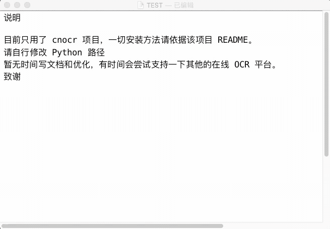

# alfred-ocr

> 由于没有项目开发经验，肯定会有一些没能处理的异常，欢迎您的使用和反馈。觉得好用的请点个 star，谢谢～

## Demo



## 版本

### 2.9 (2019-12-01 10:30)

- 支持百度接口识别多个二维码

<details>
  <summary>历史版本</summary>

### 2.7 (2019-11-30 11:06)

- 支持检查并下载更新

### 2.6 (2019-11-29 21:59)

- 支持腾讯优图
- 重写部分代码，为批量识图作准备

### 2.5 (2019-11-28 23:18)

- 优化速度：百度接口的 token 有效期为 2592000 s (30 d)，数据将被保存在`./baidu_api_token.json`并每 30 天更新一次，减少请求时间

### 2.4 (2019-11-28 10:49)

- 临时截图文件移动至`/tmp/ocr_screenshot.png`
- 不再使用`rm`删除临时文件

### 2.3 (2019-11-27 19:36)

- Python 路径由环境变量直接提供（需自行修改）
- api_key 由 Python 直接获取环境变量
  </details>

## 接口

### CNOCR

#### 说明

1. 项目地址: [CNOCR](https://github.com/breezedeus/cnocr)
2. 只支持 Python3
3. 一切安装方法请依据该项目 [README](https://github.com/breezedeus/cnocr/blob/master/README.md)。

### Baidu OCR

#### 说明

1. 官方地址: [Baidu OCR](https://ai.baidu.com/tech/ocr)
2. 考虑到不能准确判别中英文符号，所有的英文逗号将被全部替换为中文逗号；但由于句点和括号可能存在其他用途，不做处理。
3. 需自行申请 api_key 和 secret_key。

### Tencent Youtu（腾讯优图）

> 已知问题：腾讯优图仅支持 1MB 以内的图片，而目前暂不会进行图片压缩，这将导致超大图片无返回。

#### 说明

1. 官方地址: [Tencent Youtu](https://ai.qq.com/product/ocr.shtml#common)
2. 考虑到不能准确判别中英文符号，所有的英文逗号将被全部替换为中文逗号；但由于句点和括号可能存在其他用途，不做处理。
3. 需自行申请 appid 和 appkey。

## 依赖

### CNOCR

```python
pip install cnocr
```

### 其他

```python
pip install requests
```

## 说明

- 虽然已经有很多大佬做过类似的 workflow，但是依然存在一些痛点没能解决；而作为一个 All in One 用户，又不想为此多开一个软件，故自制了本 workflow。
- 本 workflow 组合了多种触发方式，以实现近似于独立软件的使用方式。
- 后续将考虑进行段落优化；同时组合更多特殊接口，如公式识别，识别翻译等，尽情期待。

## TODO

- [ ] 接入更多 OCR 平台
  - [x] 腾讯优图
  - [ ] Google
- [ ] 多文件识别
- [x] 二维码识别
- [ ] 截图翻译

## 致谢

1. [breezedeus/cnocr](https://github.com/breezedeus/cnocr)
2. 调用系统截屏的方案源于：[ginfuru/alfred-screen-capture](https://github.com/ginfuru/alfred-screen-capture)
3. Alfred Workflow 的设计方案来源于：[oott123/alfred-clipboard-ocr](https://github.com/oott123/alfred-clipboard-ocr)
