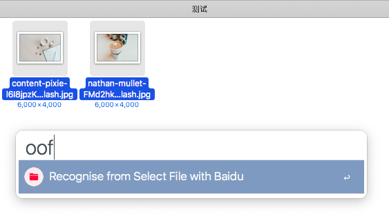

# Alfred - OCR and Translation

## Language

[简体中文](https://github.com/Chandler-Lu/alfred-ocr/blob/master/README-CN.md) | English

## Download

[China-Mirror](http://bz.cndzq.com/ltr970503/3_software/2_tool/Capture%20then%20OCR.zip) | [Github-Release](https://github.com/Chandler-Lu/alfred-ocr/releases "Github-Release")

## OCR Demo


## Version

### 4.2

- the trigger keyword `ooq` was replaced with the QR code recognition by a open source module [ZXing](https://github.com/dlenski/python-zxing).

## Feature

- Offline OCR (CNOCR)
- Online OCR (Baidu | Tencent Youtu | Google)
- QR Code Reader (Baidu | ZXing)
- Form OCR (Baidu)
- Multi File OCR (Baidu)
- Translate (ColorfulClouds)

## Installation

- You need install at least Alfred 3 or latest version and activate Powerpack;
- You need install Python 3 and necessary modules, then fill Python 3 Path at `PYTHON_PATH`;
- You need to apply and fill the configuration of the API Key into the environment variable;
- More installation details: [Install-Python(EN)](https://github.com/Chandler-Lu/alfred-ocr/wiki/Install-Python(CN))

## Python Module

### CNOCR

```bash
 pip install cnocr
```

### ZXing

```bash
 pip install zxing
```

### Others

```bash
 pip install requests
```

## Interfaces

### [CNOCR](https://github.com/breezedeus/cnocr)

#### Trigger

- Use keyword `oo` to trigger screenshot selector.

#### Description

- More installation details: [README](https://github.com/breezedeus/cnocr/blob/master/README.md).

### [Baidu AI](https://ai.baidu.com/tech/ocr)

#### Trigger

1. Online OCR: Use shortcut key ctrl + v to trigger screenshot selector or Taking screenshot to clipboard then use keywords oob (baidu) to trigger.
2. QR Code Reader: Taking screenshot to clipboard then use keywords ooqb (qr baidu) to trigger.
3. Form OCR: Taking screenshot to clipboard then use keywords ooe (excel) to trigger, then you can copy it to Excel.
4. Multi File OCR: Select file in Finder and use keywords oof (file) to trigger.



#### Description

1. QR Code support reading multiple at the same time;
2. The test token does not guarantee availability, you can apply for it if you need stability;
3. Single picture up to 4MB .

### [Tencent Youtu](https://ai.qq.com/product/ocr.shtml#common)

#### Trigger

- Online OCR: Taking screenshot to clipboard then use keywords oot (tencent) to trigger.

#### Description

1. The test token does not guarantee availability, you can apply for it if you need stability;
2. Single picture up to 1MB .

### [Google OCR](https://cloud.google.com/vision/docs/ocr)

#### Trigger

- Online OCR: Taking screenshot to clipboard then use keywords oog (google) to trigger.

#### Env Variable

| Name              | Description                                         |
| ------------------- | ------------------------------------------------ |
| google\_access\_token | API Key                                         |
| google\_post\_referer | Referer parameter in HTTP request, default null             |
| google\_http\_proxy   | HTTP Proxy, default null. Reference: `127.0.0.1:1234` |

#### Description

- Google OCR is a fee-paying interfaces and requires a credit card. Therefore, this project does not have a test token. You must apply for it.

### [ZXing](https://github.com/dlenski/python-zxing)

#### Trigger

- QR Code Reader: Taking screenshot to clipboard then use keywords ooq to trigger.

#### Description

1. More installation details: [README](https://github.com/dlenski/python-zxing/blob/master/README.md);
2. Only supports single QR code recognition.

## TODO

- Paragraph optimization.
- Screenshot translation.

## Reference

1. [breezedeus/cnocr](https://github.com/breezedeus/cnocr)
2. [dlenski/python-zxing](https://github.com/dlenski/python-zxing)
3. [ginfuru/alfred-screen-capture](https://github.com/ginfuru/alfred-screen-capture)
4. [oott123/alfred-clipboard-ocr](https://github.com/oott123/alfred-clipboard-ocr)
5. [Elvis Cai](https://github.com/elviscai)